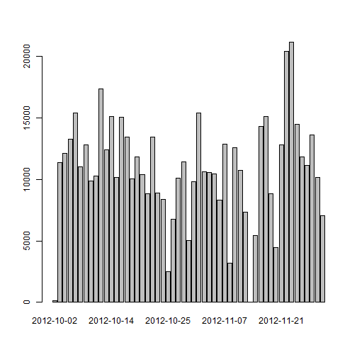

## Loading and preprocessing the data


```r
library(dplyr)
data=read.csv("activity.csv",colClasses=c("numeric","Date","numeric"))
data_tb=tbl_df(data)
```

## What is mean total number of steps taken per day?


```r
pta1=filter(data_tb,!is.na(steps))
pta2=group_by(pta1,date)
pta3=summarise(pta2,steps=sum(steps))
pta4=filter(pta3,!is.na(steps))
barplot(pta4$steps,names.arg=pta4$date)
```

 

The mean total number of steps taken is 1.0766189 &times; 10<sup>4</sup> and the median total number of steps taken is 1.0765 &times; 10<sup>4</sup>.

## What is the average daily activity pattern?


```r
ptb1=group_by(data_tb,interval)
ptb2=filter(ptb1,!is.na(steps))
ptb3=summarise(ptb2,ave=mean(steps))
ptb3$interval=as.numeric(as.character(ptb3$interval))
ptb4=ptb3[order(ptb3$interval),]
plot(ptb4$interval,ptb4$ave,type='l', xlab='Interval',ylab='Average number of steps')
```

 

The interval with the most number of steps is interval 835.

## Imputing missing values
The number of rows with missing values is: 2304.  
Strategy: Use mean for the 5 min interval


```r
ptc1=data_tb
for (i in 1:nrow(ptc1)){
    if (is.na(ptc1[i,1])){
        a=filter(ptb4,interval==as.numeric(ptc1[i,3]))
        ptc1[i,1]=a[1,2]
    }
}
ptc2=group_by(ptc1,date)
ptc3=summarise(ptc2,steps=sum(steps))
barplot(ptc3$steps,names.arg=ptc3$date)
```

 

## Are there differences in activity patterns between weekdays and weekends?
